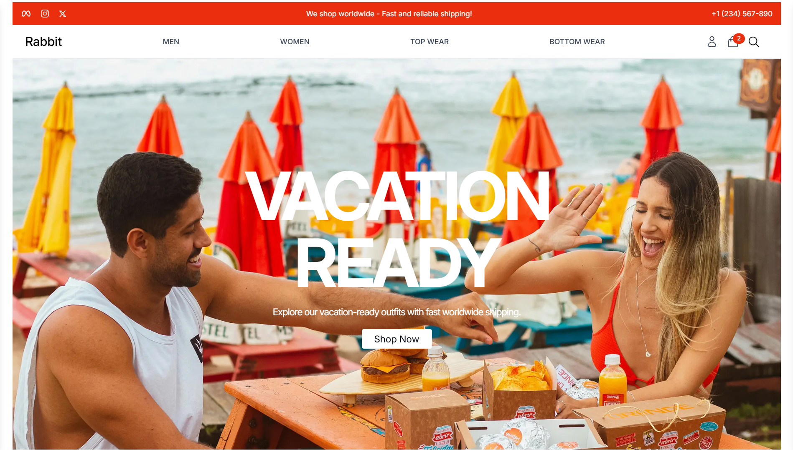
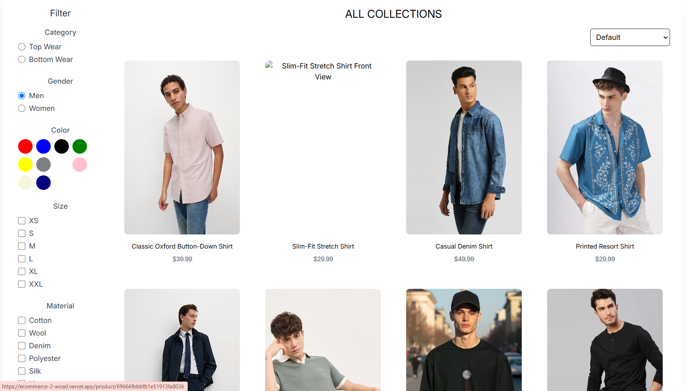
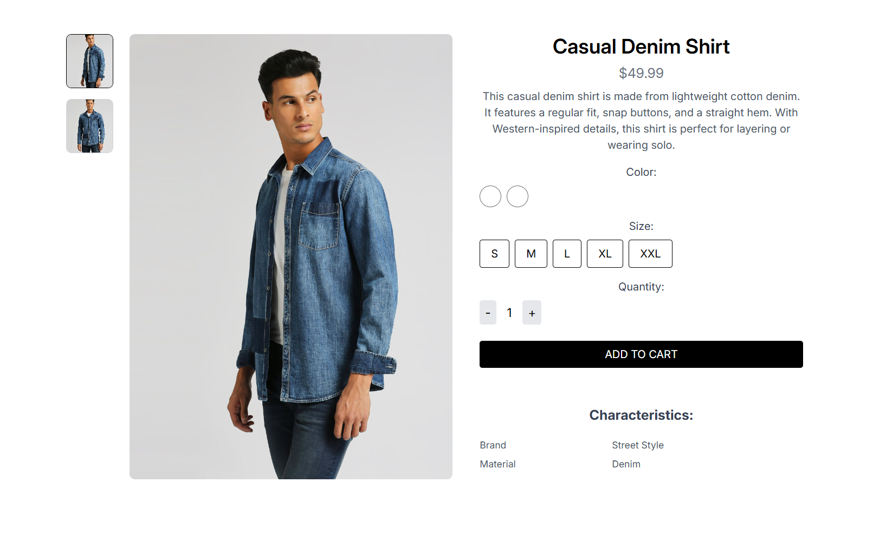
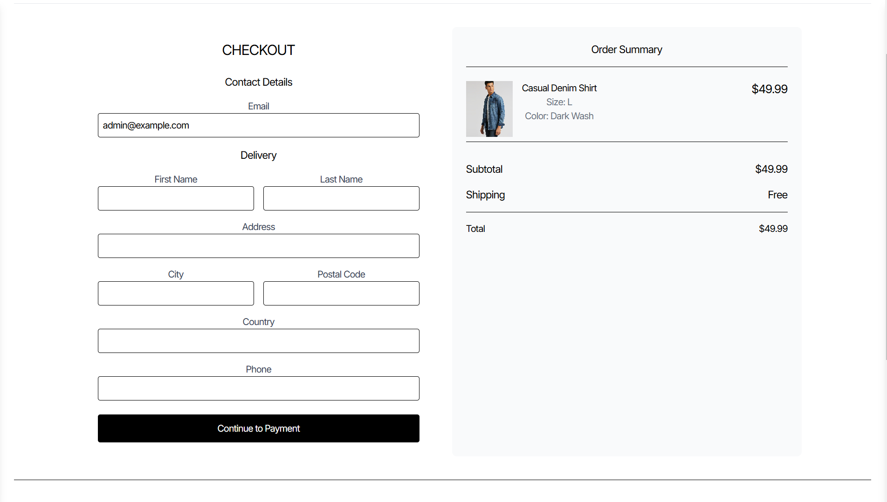

# Rabbit — E-commerce Website



A modern, full-stack e-commerce application featuring a Vite + React frontend and a Node.js + Express backend with MongoDB. This repo demonstrates product catalog browsing, user authentication, cart & checkout, order management and an admin panel — plus tools for uploads and seeding sample data.

---

## Quick project summary

**Rabbit** is an example e-commerce platform that showcases an end-to-end shopping flow:

- Customer-facing store with product discovery, filtering, and product detail pages
- Cart management and checkout flow (server-side checkout model)
- Authentication (JWT) and user profiles
- Admin area for user/product/order management
- Image uploads via Cloudinary and sample data seeding

---

## Features

- Product listing, sorting, & filtering
- Product details with image gallery
- Persistent cart and server-side checkout flow
- User authentication & JWT tokens
- Order history & admin order management
- Image uploads (Cloudinary)
- Seed script to populate sample products and an admin user

---

## Directory structure

```
├── backend/        # Node.js/Express backend API
│   ├── config/     # DB connection
│   ├── data/       # seed data (products)
│   ├── models/     # Mongoose models
│   ├── routes/     # Express routes
│   └── server.js
├── frontend/       # React + Vite frontend app
│   ├── src/        # React components, pages, assets
│   └── public/
├── images/         # Images used in the README and docs
├── README.md       # Project overview (this file)
└── package.json    # Root scripts/dependencies (minimal)
```

---

## Visual guide to images

Below are visual previews of all images located in the `images/` folder used across the UI and documentation.

| Preview | Description | Where Used |
|---|---|---|
|  | Main landing / hero screenshot | Home page / README banner |
|  | Men collection preview image | Product collections / sections |
|  | Product grid / shop preview | Collection/Product listing page |
|  | Cart & checkout screenshot | Checkout page |

---

## Getting started

### Local development setup

1. Clone the repo and install dependencies

```bash
git clone <repo-url>
cd <project-root>
# Install backend deps
cd backend
npm ci
# Install frontend deps
cd ../frontend
npm ci
```

2. Environment variables

Create `backend/.env` with at least:

```
MONGO_URI="<your-mongo-uri>"
JWT_SECRET="<your-jwt-secret>"
CLOUDINARY_CLOUD_NAME="..."
CLOUDINARY_API_KEY="..."
CLOUDINARY_API_SECRET="..."
```

For frontend builds, set `VITE_BACKEND_URL` (build-time):

```
VITE_BACKEND_URL=http://localhost:9000
```

3. Run backend & frontend

```bash
# start backend
cd backend
npm run dev   # or npm start

# in a new terminal - start frontend
cd frontend
npm run dev
```

Open `http://localhost:5173` to view the app.

---

## Seed the database (sample data)

The backend includes `seeder.js` to populate sample products and an admin user.

```bash
cd backend
# make sure MONGO_URI points to your Atlas cluster
npm run seed
```

Default seeded admin credentials: **admin@example.com / 123456**

---

## Deploying

### Backend on Render

- Create a new **Web Service** on Render pointing to the `backend` directory.
- Build Command: `npm ci`, Start Command: `npm start`.
- Add environment variables: `MONGO_URI`, `JWT_SECRET`, `CLOUDINARY_*`.
- Use Render Shell to run `npm run seed` once if you want sample data on the cloud DB.

### Frontend on Vercel

- Create a new Vercel project for the `frontend` directory.
- Set build command: `npm run build` and output dir: `dist`.
- Add environment variable `VITE_BACKEND_URL` set to your Render backend URL (production & preview).
- Deploy. Ensure `VITE_BACKEND_URL` is available during the build (set it before deploying).

---


## Contributing

Contributions welcome — open issues or PRs. Please describe changes and add screenshots for UI updates.
